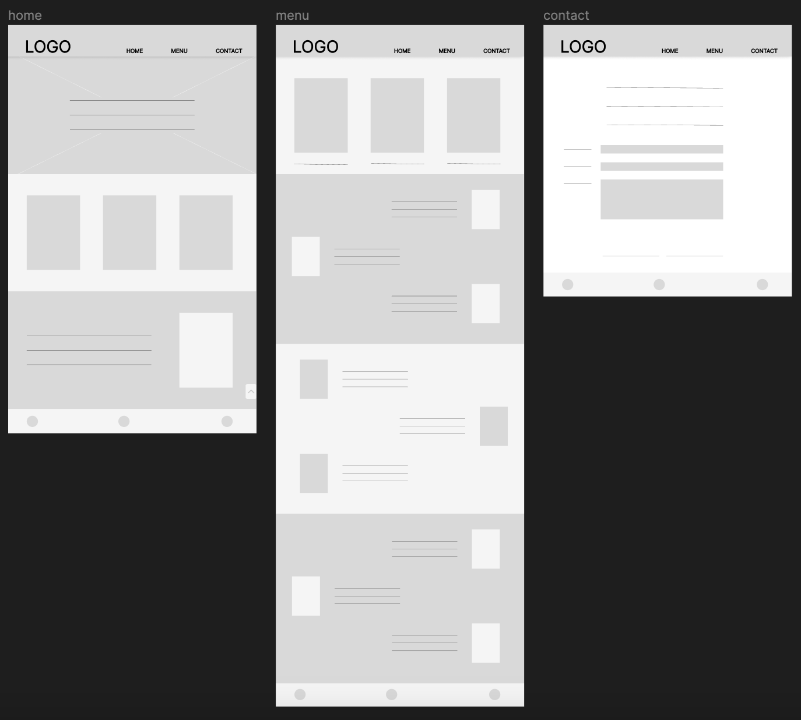
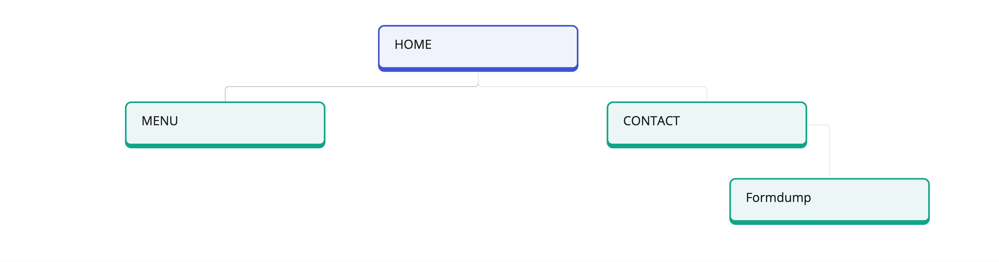
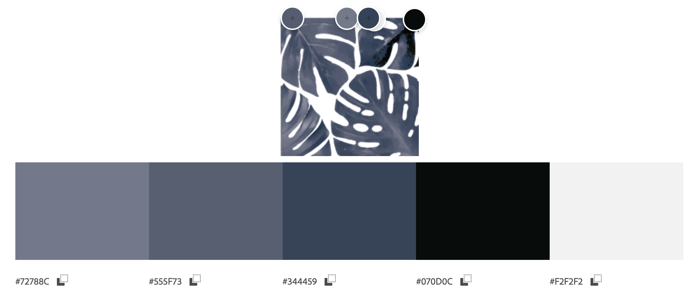

# Baiana

Visit [Baiana's website here](https://vidalwesley92.github.io/baiana/index.html)

## Table of Contents

1. [Introduction](#Introduction)
2. [UX](#UX)
    1. [Target Audience](#Target-Audience)
    2. [User Stories](#User-Stories)
    3. [Site Aims](#Site-Aims)
3. [Design](#Design)
     1. [Wireframes](#Wireframes)
     2. [Site Structure](#Site-Structure)
     3. [Imagery used](Imagery-used)
     4. [Colour Scheme](Colour-Scheme)
     5. [Typography](#Typography)
4. [Features](#Features)
5. [Testing](#Testing)
6. [Bugs](#Bugs)
7. [Technologies Used](#Technologies-Used)
8. [Deployment](#Deployment)
9. [Credits](#Credits)
10. [Acknowledgements](#Acknowledgements)

## Introduction

Creating a webpage for Baiana, a catering service specializing in typical food from Bahia, offers a unique opportunity to showcase the rich culinary heritage of the region to a wider audience. By establishing an online presence, Baiana can effectively market its authentic Bahian dishes, attracting both local customers seeking traditional flavors and tourists interested in experiencing the culture through its cuisine. A webpage allows Baiana to highlight its menu offerings,facilitate online orders or inquiries.

[Go to top ⇧](#Baiana)

## UX
### Target Audience

1. Locals: Residents of Ireland interested in exploring international cuisines and experiencing the vibrant flavors of Bahian dishes.

2. Brazilian Immigrants: Members of the Brazilian community living in Ireland who seek authentic Brazilian flavors and dishes reminiscent of their homeland.

3. Tourists: VVisitors to Ireland looking for unique dining experiences and interested in trying traditional dishes from different regions of the world.

4. Event Organizers: Individuals or businesses planning events, gatherings, or celebrations who require catering services that offer unique and culturally rich menu options.

## User Stories

* Andreia, a Brazilian expat residing in Dublin, wants to introduce her Irish friends to the delicious cuisine of Bahia and is searching for a catering service that can provide a taste of home for her dinner gathering.

* Liam, an Irish food enthusiast, is intrigued by international cuisines and is excited to explore the vibrant flavors of Bahian dishes offered by Baiana Catering Service.

* Aoife, an event planner in Galway, is organizing a corporate event and is interested in incorporating diverse menu options, including authentic Bahian cuisine, to impress her clients.

## Site Aims

- The primary objective of the website is to market Baiana's authentic Bahian dishes;

- Attracting both local customers seeking traditional flavors and Brazilian immigrants longing for a taste of home;

- Facilitate online orders or inquiries to streamline the catering process and enhance customer satisfaction.

[Go to top ⇧](#Baiana)

# Design

By incorporating these features and design guidelines, Baiana's website aim to effectively connect with both the Irish market and the Brazilian immigrant community in Ireland.

## Wireframes

At a "pre-production" stage of the creation of this website, Figma was used to create the wireframes that facilitated the development process of the website. These wireframes serve as a visual guide, outlining the layout, structure, and functionality of each page or screen within the website. By using Figma, a collaborative design tool, designers and developers can work together seamlessly to iterate on the design, make revisions, and ensure that the final product meets the desired objectives and user needs.

Wireframe

## Site Structure

This structure outlines the main sections and sub-sections of the site, ensuring a seamless browsing experience for the user.

Sitemap

## Imagery used
The images utilized in the development of this website are a combination of personal photographs captured by the creator and selected images sourced from various online platforms.

this a complete lis of the reasources and where it came from:

| PICTURE NAME | SOURCE |
| -------- | ------- |
| beijinho | https://casaeculinaria.com/receitas/doces-e-sobremesas/  |
| bobo | https://www.charlo.com.br/produto/bobo-de-camarao-com-acaca-300 |
| brigadeiro | https://br.freepik.com/fotos-gratis/trufa-de-chocolate-caseira-em-um-prato-com-fundo-desfocado_28711040.htm#fromView=search&page=1&position=7&uuid=41fe24f1-7e67-40da-a868-423de9e807e1 |
| cajuzinho | https://yesportuguese.com/cajuzinho |
| caruru | https://www.guiadasemana.com.br/receitas/galeria/caruru-baiano-receita-original-bahia |
| casadinho | https://www.amandocozinhar.com/2023/01/brigadeiro-casadinho.html |
| catering | https://www.freepik.com/icon/catering_1940899#fromView=search&page=1&position=3&uuid=16c8aa66-6784-4f74-b66b-cb89bcbe9709 |
| food_delivery | https://www.freepik.com/icon/tray_6099684#fromView=search&page=1&position=37&uuid=05cc1484-4c7b-4234-8a93-a55829cfe6b6 |
| huaca | https://www.omundoeseu.com.br/conheca-as-20-comidas-tipicas-da-bahia-que-voce-precisa-provar/  |
| meal_event | https://www.freepik.com/icon/schedule_10838166#fromView=search&page=1&position=1&uuid=e5d3f179-9b50-4f6e-9096-af705e95d9f6 |
| moqueca | https://www.omundoeseu.com.br/conheca-as-20-comidas-tipicas-da-bahia-que-voce-precisa-provar/  |
| olho_de_sogra | https://diariodonordeste.verdesmares.com.br/estilo-de-vida/culinaria/docinho-de-ameixa-aprenda-a-fazer-a-sobremesa-tradicional-1.3194436  |
| rabada | https://www.omundoeseu.com.br/conheca-as-20-comidas-tipicas-da-bahia-que-voce-precisa-provar/  |
| uva-encapada | https://vegcomcarinho.com.br/2022/12/01/como-fazer-surpresa-de-uva/ |
| vatapa | https://globorural.globo.com/vida-na-fazenda/receitas/noticia/2022/04/como-fazer-vatapa-cremoso-e-com-consistencia-firme.html |
| vegetables | https://www.freepik.com/free-photo/buddha-bowl-dish-with-vegetables-legumes-top-view_13807905.htm#fromView=search&page=1&position=2&uuid=72be37fd-05bc-4d04-b52a-267ebe23c8cc |

The other images featured in this project is a selection of personal photographs taken by Wesley Vidal, the creator of this website. Wesley Vidal has generously granted permission to utilize these images specifically for this project, ensuring compliance with copyright regulations.

## Colour Scheme

The color scheme for this project was meticulously curated by referencing the brand's logo and employing the powerful tools provided by [Adobe Color](https://color.adobe.com/). By inputting the brand's logo into Adobe Color, They were able to extract harmonious color palettes that resonate with the essence and identity of the brand. This process ensures that the chosen colors not only complement the logo but also maintain consistency throughout the project, creating a cohesive and visually appealing design aesthetic.

Color Scheme

## Typography

The typography of the Baiana website was carefully curated to reflect its personality: simplistic yet classic. Leveraging Google Fonts, Roboto Flex was chosen for its clean and responsive design, while Playfair Display adds a touch of sophistication to headings and visual elements, creating a balanced and cohesive typographic palette.

| Fonte | Source |
|-------|--------|
| Roboto Flex | https://fonts.google.com/specimen/Roboto+Flex?preview.text=Baiana%20comida%20tipica%20do%20T&preview.size=35&stroke=Sans+Serif |
| Playfair Display | https://fonts.google.com/specimen/Playfair+Display?preview.text=Baiana%20comida%20tipica%20do%20T&preview.size=35&stroke=Serif |

[Go to top ⇧](#Baiana)
# Features

The Baiana website have the following feature:

* [Home page](https://vidalwesley92.github.io/baiana/index.html)
     - Header with a full responsive navegation bar that gives access to two other pages;
     - Hero image that in a way introduces the page and it´s intetion to the user;
     - A body section that be navegated through scrolling;
     - "Go to top "o the page link;
     - A footer that gives access to all three main social media pages.

* [Menu](https://vidalwesley92.github.io/baiana/menu.html)
     - Header with a full responsive navegation bar that gives access to two other pages;
     - Display with links that gives easy access to the diffent sections of the page;
     - Sections of the page with pictures a ddeescriptions of the products that the Baiana service can provide to the users;
     - "Go to top "o the page link;
     - A footer that gives access to all three main social media pages.

* [Contact](https://vidalwesley92.github.io/baiana/contact.html)
     - Header with a full responsive navegation bar that gives access to two other pages;
     - Form that allows the users to communicate withh the service provider;
     - A footer that gives access to all three main social media pages.

[Go to top ⇧](#Baiana)
# Testing
In this section of the README, various tests that the website underwent are showcased to assess its functionality.
Each test provides valuable insights into the website's performance, functionality, and areas that require attention for future enhancements and optimizations.

## Code Validation

All codes have been validated successfully. The HTML passed through the [W3C HTML Validator](https://validator.w3.org/) and the CSS through the [W3C CSS Validator](https://jigsaw.w3.org/css-validator/). The following images display their respective validation results.

Index Page Validation

Menu Page Validation

Contact Page Validation

CSS Validation

## Responsiveness

In order to assess the responsiveness of the website, it was tested across various browsers and screen sizes, ranging from mobile phones to 4K desktop screens. Overall, the results were positive, with only one major bug identified.

The bug was discovered on the Firefox browser, where it did not accept the width/max-width command as expected. Thanks to the Stack Overflow community, a solution was found. The solution involved applying a -moz- media query to apply specific dimensions only on Firefox browser ([Read Bugs](#Bugs) ).

In all other browsers tested, the website performed well and displayed as expected across different screen sizes.

## Lighthouse Testing

The website was subjected to the Lighthouse test to assess its quality and identify areas for improvement. The following images display the results of the test for both the mobile and desktop versions.

Lighthouse Mobile Test

Lighthouse Desktop Test

  
The test results indicated that despite the images being in the WebP format, further optimization is required, including proper sizing and compression, to achieve a higher score. This optimization is necessary and should be prioritized for future improvements.

## Accessibility Testing

After running the page through the [Wave Accessibility Evaluation Tool](https://wave.webaim.org/),  the following results were obtained.

Home Page Test

Menu Page Test

contact Page Test

## Manual Testing

Manual testing was conducted by myself, along with a friend and several coworkers. This collaborative effort resulted in gathering valuable information, ranging from identifying bugs to outlining future improvements for the website. Below is a table summarizing the testing processes, expectations, and results:

| Feature | Expectation | Action | Result |
|---------|-------------|--------|--------|
| Homepage navigation | Smooth scroll up and down experience expected | Scroll | Scroll experience was smooth|
| Nav Bar | Open pages on click | Click | Pages opened when clicked |
| Footer links | New page open on click | click | New page was opened when clicked|
| Image resize| Dimension changes when the pages are resized| Resize | The images were resized when the pages size changed|
| Resposivnes| Resposive behavior in multiple screens | Open the page in different sized screens| The website behaved responsive, except for Firefox|
| Form Submit | Open form dump page | Submit Form | Form dump page was open |

[Go to top ⇧](#Baiana)
# Bugs

During testing, several bugs were discovered, leading to malfunctions in certain features of the website. Below are some of the identified bugs along with their respective solutions.

## Bugs Fixed

| Bug Description | Browser/ Devices | Severity | Status/ Solution |
|-----------------|------------------|----------|--------|
|Unable to change size of icons contained within “i” tags | All | Minor | Fixed. Instead of resizing with the width and height attributes, font-size was used. |
| br tag not working in Mozilla Firefox | FireFox | Moderate | Fixed. Removed the br tag and replaced the spacing with margin property. |
Firefox wasn´t accepting the width property changing the images dimensions | Firefox |  Major | Fixed. Media query found on Stack Overflow solved the problem by applying a rule that would affect Firefox. ("@-moz-document url-prefix()")|
|Menu links doesn't jump the right position on the page | all | Minor | To be fixed. As of now, the menu links jump to the approximate area they are intended to. |
|Font size on screens above 1200px doesn´t act responsive as it is supposed to | all | Moderate | To be Fixed. |

[Go to top ⇧](#Baiana)

# Technologies Used

### Laguagues used

* HTML5
* CSS3

### Frameworks, libraries etc

* [Google Fonts](https://fonts.google.com/);
* [GitPod](https://gitpod.io/);
* [GitHub](https://github.com/);
* [Code Anywhere](https://codeanywhere.com/);
* [Figma](https://www.figma.com/);
* [Cloud Convert](https://cloudconvert.com/);
* [W3School Color Converter](https://www.w3schools.com/colors/colors_converter.asp)

[Go to top ⇧](#Baiana)

# Deployment

To deploy this project's repository, follow these steps:

1. Go to the Baiana repository on GitHub.
2. Ensure that the HTML, CSS files, and the assets folder are in the repository.
3. Navigate to the repository's navigation bar and open the "Settings" section.
4. In the side menu, locate the "Pages" section and open it.
5. Under the "Source" section, select "Deploy from the main branch".
6. In the Branch section, select "main".
7. Next to the branch options, select the Root folder.
8. After selecting the branch and the folder, click "Save".
9. Once saved, return to the repository and locate the deployments section on the right side of the page, then open it.
10. After opening, the deployed link will be displayed under the title "All deployments" with the following structure: https://vidalwesley92.github.io/baiana/.

[Go to top ⇧](#Baiana)

# Credits 

through out this project many resources was utilised in order to complete it. Here are the names of the resource que there due credit.

| resources | Credit|
|-----------|-------|
| ChatGPT | The text, grammar, and spelling were refined, and copyright considerations were addressed with the assistance of ChatGPT. |
| Favicon.io | Fast creation of all favicons necessary for the project. |
| Freepik | Offering a vast collection of free and premium graphic resources |
| Stack overflow | Collection of questions and answers helping with debuging. |
| Love Running Project |Reference for coding workflow and good practices. |

[Go to top ⇧](#Baiana)

# Acknowledgements

Speacial thank you to:

* Amy, our cohort facilitator, for her availability, assistance, and encouragement throughout all the stages of this project;

* Seun Owonikoko for all of her valuable inputs, orientation, and for sharing some of her real-world experiences;

* Friends and colleagues for all the help provided during testing.

[Go to top ⇧](#Baiana)

