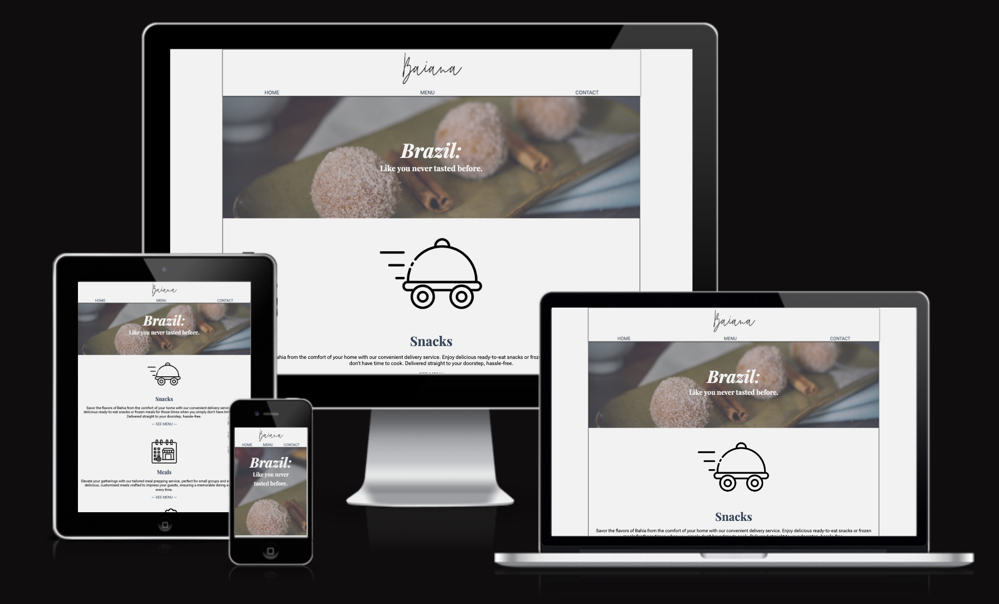

# Baiana

Visit [Baina's website here](https://vidalwesley92.github.io/baiana/index.html)

## Table of Contents

1. [Introduction](#Introduction)
2. [UX](#UX)
    1. [Target Audience](#Ideal-User-Demographic)
    2. [User Stories](#User-Stories)
    3. [Development Planes](#Development-Planes)
    4. [Design](#Design)
3. [Features](#Features)
    1. [Design Features](#Design-Features) 
    2. [Existing Features](#Existing-Features)
    3. [Features to Implement in the future](#Features-to-Implement-in-the-future)
4. [Issues and Bugs](#Issues-and-Bugs)
5. [Technologies Used](#Technologies-Used)
     1. [Main Languages Used](#Main-Languages-Used)
     3. [Frameworks, Libraries & Programs Used](#Frameworks,-Libraries-&-Programs-Used)
6. [Testing](#Testing)
     1. [Testing.md](TESTING.md)
7. [Deployment](#Deployment)
     1. [Deploying on GitHub Pages](#Deploying-on-GitHub-Pages)
8. [Credits](#Credits)
     1. [Content](#Content)
     2. [Media](#Media)
     3. [Code](#Code)
9. [Acknowledgements](#Acknowledgements)

## Introduction

Creating a webpage for Baiana, a catering service specializing in typical food from Bahia, offers a unique opportunity to showcase the rich culinary heritage of the region to a wider audience. By establishing an online presence, Baiana can effectively market its authentic Bahian dishes, attracting both local customers seeking traditional flavors and tourists interested in experiencing the culture through its cuisine. A webpage allows Baiana to highlight its menu offerings,facilitate online orders or inquiries.

[Go to top ⇧](#Baiana)

## UX
### Target Audience

1. Local Residents: Individuals living in Bahia or nearby regions who are interested in experiencing authentic Bahian cuisine or planning events that require catering services.
2. Tourists: Visitors to Bahia who want to explore the local culture through its cuisine and may be looking for catering options for events or gatherings during their stay.
3. Food Enthusiasts: People interested in exploring diverse culinary experiences and trying traditional dishes from different regions.
